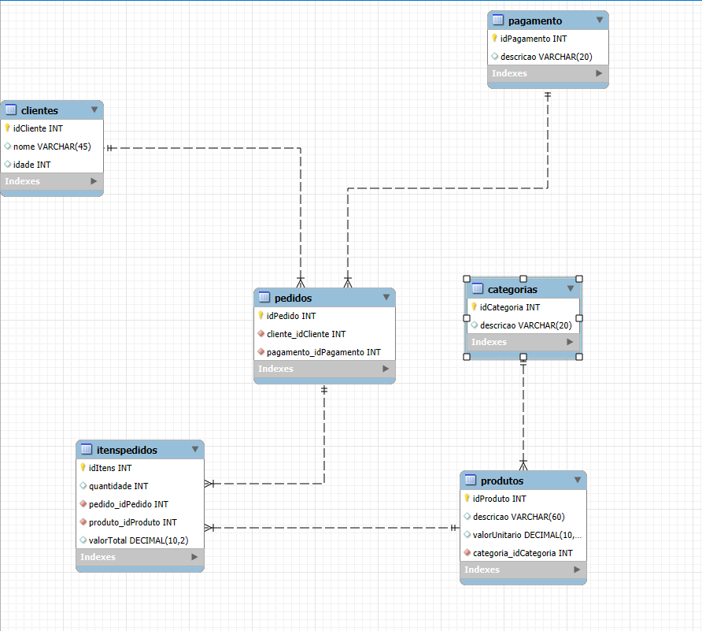

# 📄 Script SQL
## Nessa pasta denominada 'dados' você encontrará o script feito em MySQL para criar o banco, garantir seu uso e criar todas as tabelas necessárias para execução do programa. Além disso, há também o modelo lógico feito em MySQL Workbench (interface gráfica de um banco MySQL)

### Modelo lógico


---
### Aqui vai um overview de alguns comandos em SQL e suas funcionalidades:
  - `CREATE DATABASE IF NOT EXISTS nome_do_banco;`
  
*Esse comando permite criar um banco de dados;*

A cláusula `IF NOT EXISTS` serve para garantir que o comando só será efetivado se o banco realmente não existir.

  - `USE nome_do_banco;`

*Esse comando serve para colocar o banco em uso;*

Normalmente, se estiver utilizando interfáces gráficas como, por exemplo, MySQL Workbench é comum clicar duas vezes com o botão direito para já coloca-lo em uso automaticamente

  - `CREATE TABLE IF NOT EXISTS ();`

*Esse comando serve para criar as tabelas do banco selecionado;*

A cláusula `IF NOT EXISTS` serve para garantir que o comando só será efetivado se a tabela realmente não existir;

Dentro do () você deve colocar os atributos da tabela NUNCA se esquecendo do atributo de identificação principal

### Exemplo

  ```
  CREATE TABLE IF NOT EXISTS categorias (
	  idCategoria INT NOT NULL PRIMARY KEY AUTO_INCREMENT,
    descricao VARCHAR(20)
  );
  ```

---
